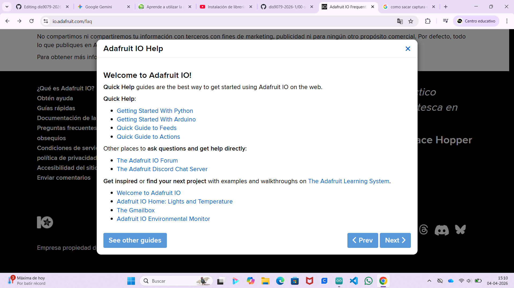
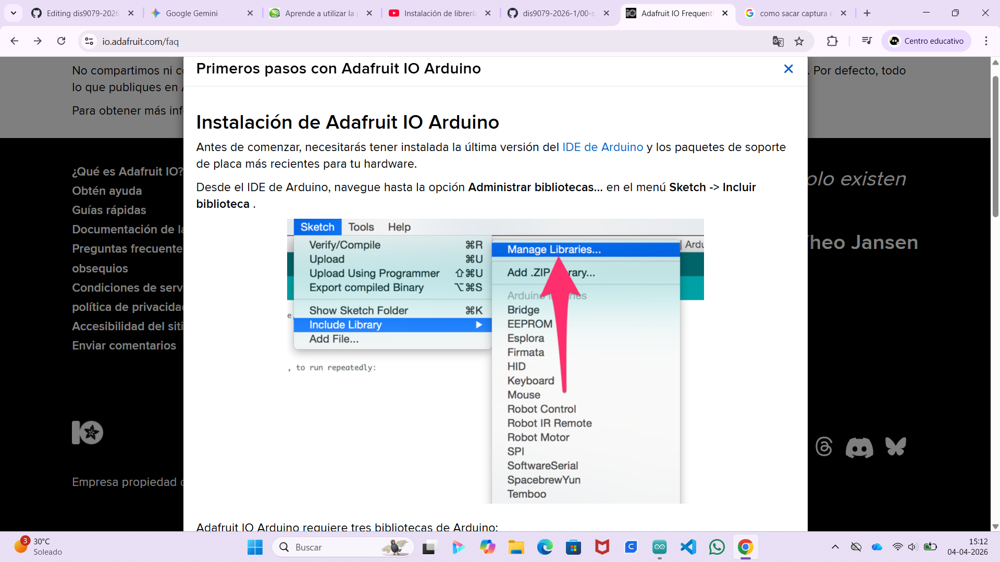
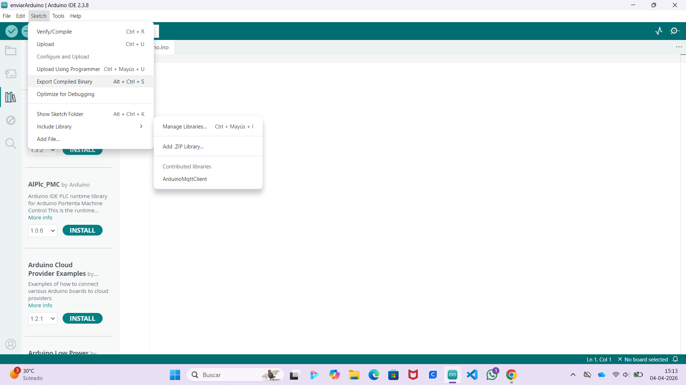
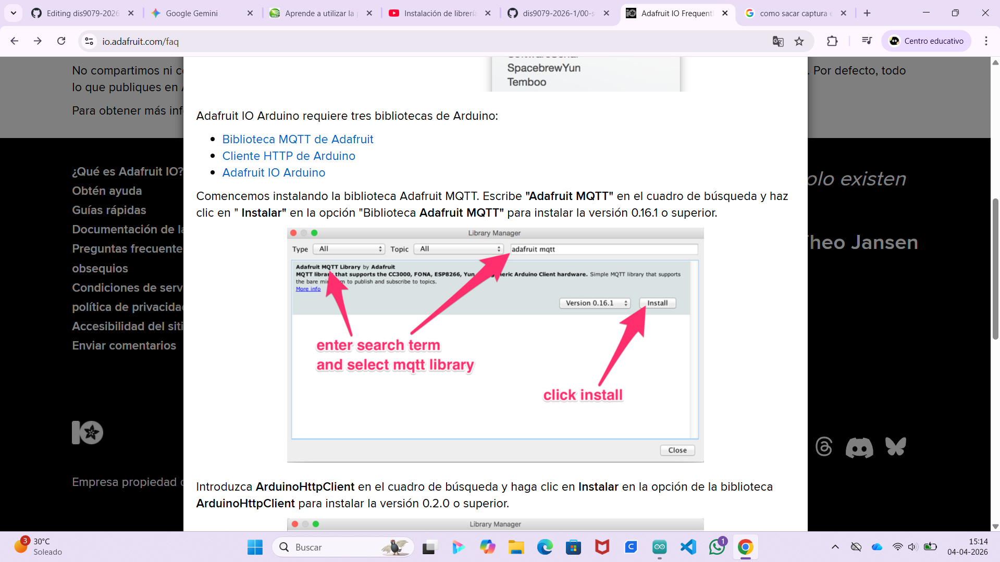
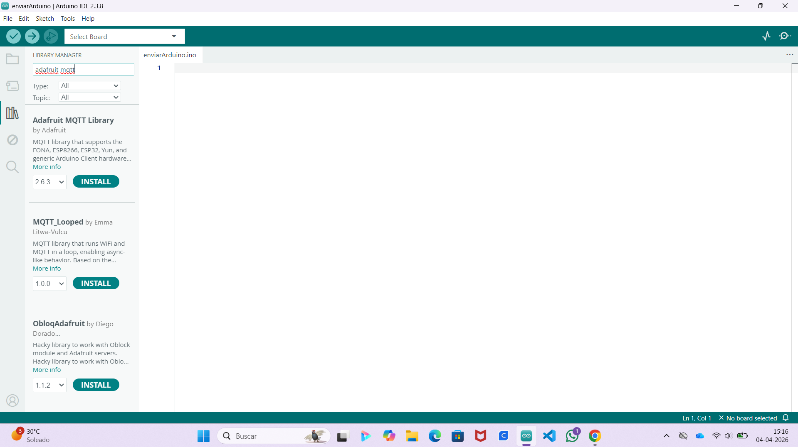
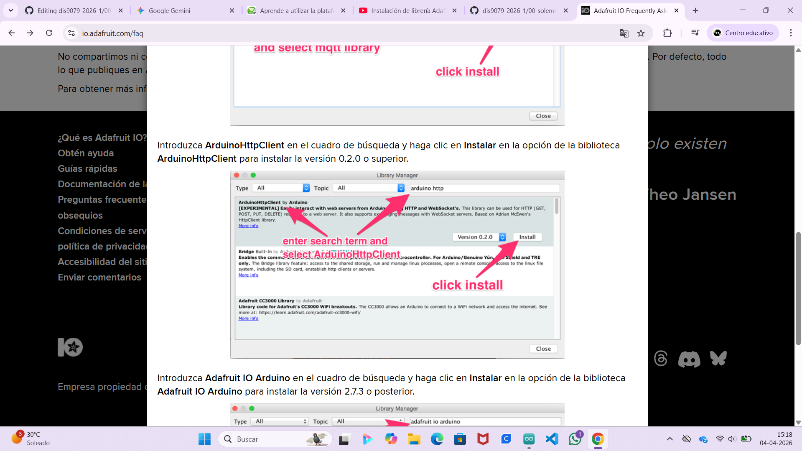
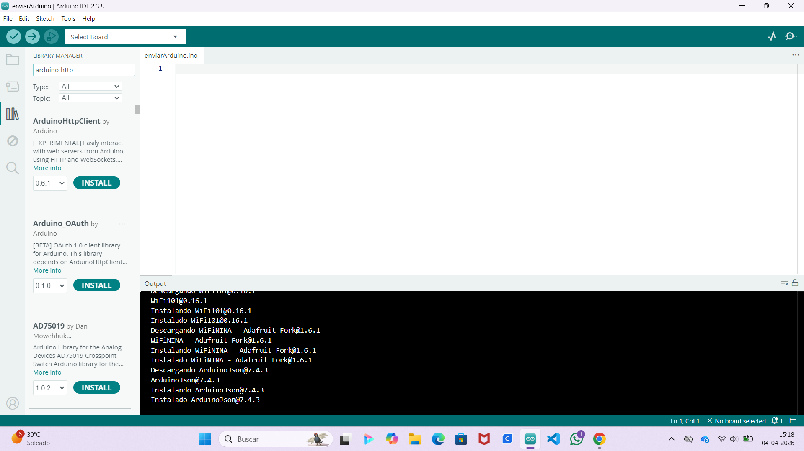
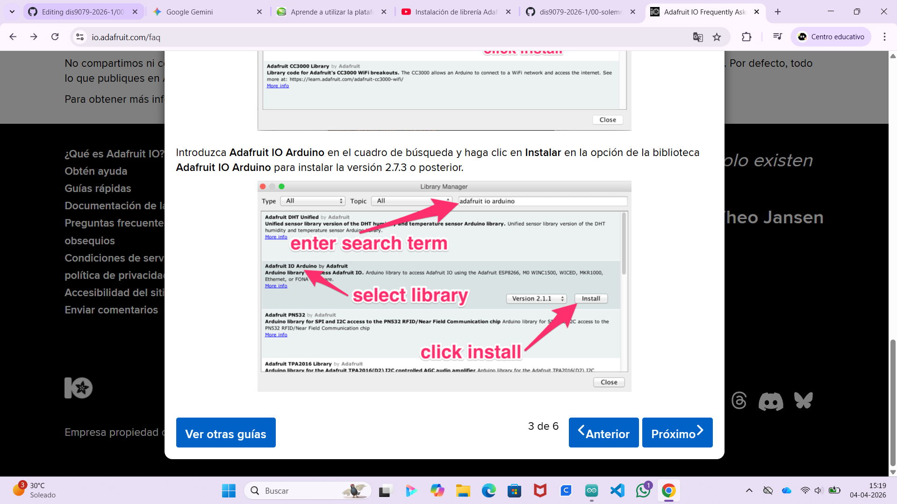
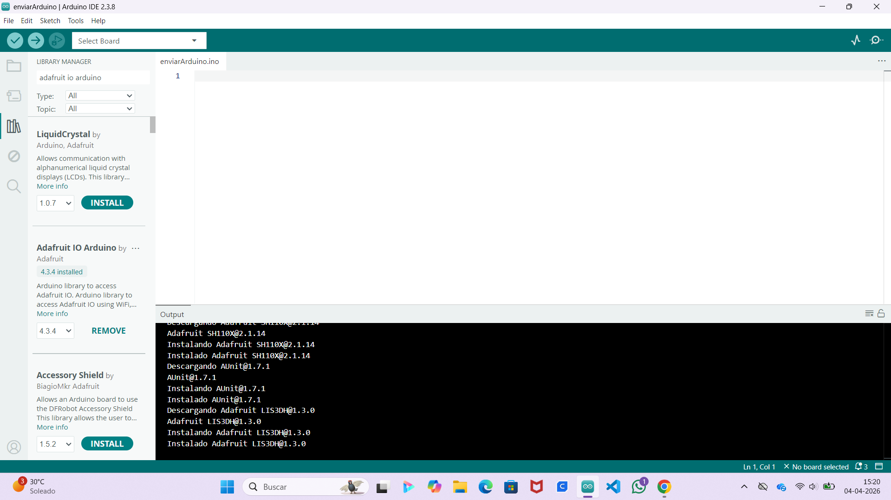

# persona-02 - Isidora Pérez Maulén

investigaciones individuales

## sobre adafruit i/o
+ Es una plataforma del internet de las cosas (IoT) basada en la nube.
+ Permite enviar, recibir y visualizar datos de tus proyectos de hardware de una manera sencilla.
+ Se destaca en su facilidad de uso y ser compatibles con placas como arduino, raspberry pi, línea circuit playground de adafruit.

## instalación adafruit 
**inicio**

**paso 1**
+ Navegar en las librerías para poder instalar las 3 bibliotecas

**paso 2**
+ Instalar adafruit MQTT

**paso 3**
+ Instalar arduinoHttpclient

**paso 4**
+ Instalar adafruitIOarduino

## sobre artista, diseñadora o producto que usa electrónica o computación inalámbricas

